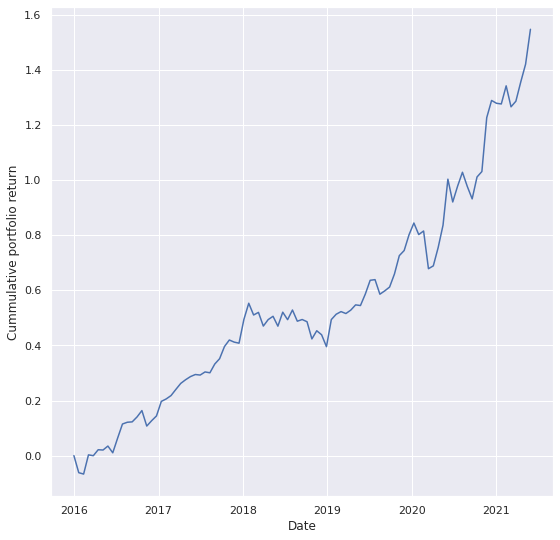
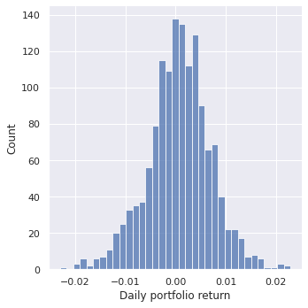
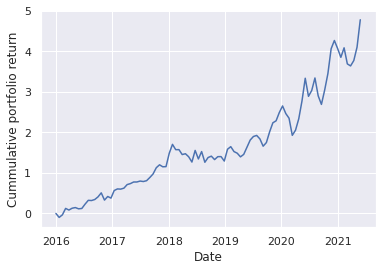
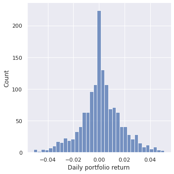

**This repository contains my implementation of algo portfolio allocation using Markowitz mean-variance model and nested clusterd optimization**

Our goal is to allocate optimal long-horizon (at least 5 years) portfolio.

Portfolio allocation method is based on Markowitz's mean-variance model.

We consider a quadratic utility function
$$U(w) = w^T \mu - \frac{\phi}{2} w^T V w$$ 

where: 
1. $w$ is the vector which represents a weight of each asset in portfolio.
2. $\mu$ is the vector of expected returns, so $w^T \mu$ is expected return of our portfolio.
3. $V$ is the covariance matrix of assets returns, so $w^T V w$ is the variance (risk) of our portfolio.
4. $\phi \ge 0$ is just the parameter, called risk aversion.

Also I used L2 regularization to encourage diversification and formulated allocation problem as: 
$$min \,\, (-U(w) + \gamma \cdot w^T w) \,\, s.t. \,\, 1_n^T w = 1$$

## Experiments

I've tried different risk aversions and implemented nested clustered optimization. Comparing with baseline which is equally-weighted portfolio, I got this results:

**Equally weighted portfolio**

  Cummulative portfolio return: **1.583**

  Annualized sharpe ratio: **1.378**

   

**Markowitz mean-variance model with NCO and risk aversion = 30**

  Cummulative portfolio return: **2.969**

  Annualized sharpe ratio: **1.382**

   

More expirements in the notebook

## Conclusion

When we operating with returns, it's mean and covariance are extremely small, that's why optimization methods are suffered from gradient vanishing problem. I've fixed it a bit with scaling.

As we can see methods were tested on bull market, that's why more risky strategies gained more. Now there is low market because of geo-political and other reasons, so during next 5 years I expect market growth. That's why I choose more risky strategy for long-horizon (at least 5 years) portfolio